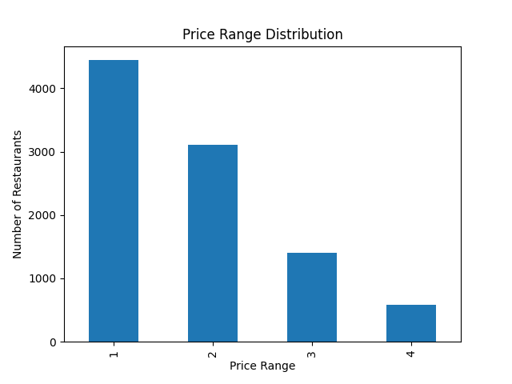
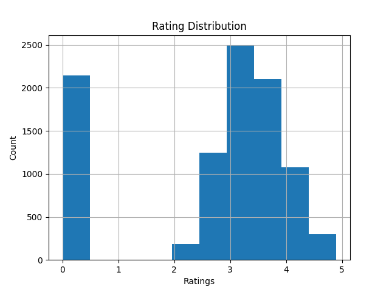

# 🍽️ Restaurant Data Analysis using Python

## 📌 Project Description
Python-based restaurant data analysis project exploring cuisines, city trends, ratings, and pricing.

## 🎯 Objective
To analyze restaurant data and extract meaningful insights related to cuisines, city trends, pricing, and customer ratings using data analysis techniques.

## 📂 Dataset Information
- Contains restaurant details such as city, cuisines, ratings, price range, and online delivery
- Used for performing exploratory data analysis and visualization

## 📚 Learning Outcomes
- Gained hands-on experience in data analysis using Python
- Learned data cleaning and transformation using Pandas
- Created visualizations using Matplotlib
- Derived business insights from real-world dataset

## 🔧 Tools Used
- Python
- Pandas
- Matplotlib

## 📊 Tasks Performed
- Identified top cuisines
- City-wise restaurant analysis
- Price range distribution
- Online delivery analysis
- Ratings analysis

## 📈 Key Results
- City with most restaurants: New Delhi  
- City with highest average rating: Bangalore  

### 🍽️ Top Cuisines
- North Indian (41.46%)
- Chinese (28.63%)
- Fast Food (20.79%)

### 🚚 Online Delivery
- Percentage of restaurants with online delivery: 35%

## 💡 Insights
- New Delhi has the highest concentration of restaurants, indicating a dense food market.
- Bangalore shows the highest average ratings, suggesting better customer satisfaction.
- North Indian cuisine dominates the dataset, followed by Chinese and Fast Food.
- Restaurants offering online delivery tend to have slightly better customer engagement and ratings.

## 📊 Visualizations
### Price Distribution


### Rating Distribution


## ▶️ How to Run
1. Install Python  
2. Install required libraries:
 ```bash
   pip install pandas matplotlib

## 📁 Files Included
- Dataset.csv
- analysis.py
- price_distribution.png
- rating_distribution.png

## 👩‍💻 Author
Lana Shree
